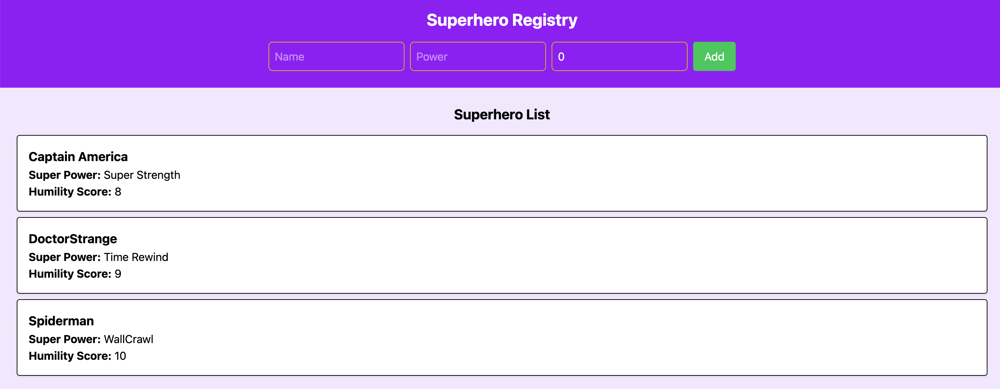

### **A Superheroes Application**




## 1. **Team Collaboration on this Superhero Application**

To make this project a success, we’d work closely as a team, breaking the work into manageable pieces so that everyone has a clear focus. Some of us might dive into the backend, designing the data models and APIs that power the superhero profiles, while others focus on making the frontend interactive and engaging. Regular check-ins—whether through quick standups, code reviews, or brainstorming sessions—would help us stay aligned and tackle challenges together.

For backend development, we’d collaborate on designing a flexible system that supports things like power scaling, relationships, and interactive elements. That means working closely with frontend developers to make sure the API is structured in a way that makes their job easier. On the frontend side, we’d focus on crafting an intuitive and fun experience, constantly sharing feedback with designers and other team members to refine layouts, animations, and storytelling elements.

Good teamwork isn’t just about writing code—it’s about communication. We’d use tools like Git for version control, JIRA or Trello for tracking tasks, and Slack or Discord for quick discussions. Regular retrospectives would help us adjust as we go, making sure we’re improving both the project and how we work together. By staying flexible and open to feedback, we’d build something truly engaging for superhero fans while making the development process smooth and enjoyable for the team.

## 2. **More todo with this SuperHero Application**

To turn this app into a full-fledged superhero Wikipedia and fan hub, I’d start by expanding the core structure to support deep, interconnected content. Instead of just listing superhero profiles, I’d introduce rich storytelling elements, like interactive timelines, detailed power breakdowns, and relationship graphs that show affiliations, rivalries, and team dynamics. This would make exploring the superhero universe feel more immersive, almost like stepping into a living, breathing world rather than just reading static pages.

To make the platform truly engaging, I’d add interactive features that pull fans into the experience. Imagine AI-powered battle simulations where users can pit their favorite heroes against each other and see dynamically generated outcomes based on their abilities. Or a feature where users can create their own superhero personas, complete with origin stories and custom power sets, which could then be added to the community database. Gamification, like quizzes, achievements, and fan leaderboards, would keep users engaged while rewarding them for their contributions.

Of course, community involvement would be at the heart of this project. A space for fan theories, user-generated content, and even moderated wiki edits would make the platform more dynamic and ever-evolving. Live events, such as Q&A sessions with creators, debates about superhero battles, or fan polls on upcoming storylines, could turn the Wikipedia into more than just an encyclopedia—it would be a gathering place for dedicated fans. By combining structured information with interactive and social elements, this project could become the ultimate hub for superhero enthusiasts worldwide.

## 3. **Requirements**

You should have docker installed

Once you have cloned the repository got into superheroes dierctory

``
cd superheroes
``

then execute the following command
```
docker build -t superhero-app .
docker run -p 80:80 -p 3000:3000 superhero-app
```

This command executes the backend on port 3000 and the frontend on 5000

## 4. **Test**

In order to execute the test

```
cd superheroes/superhero-app
npm test

```

and the following test suites will get executed